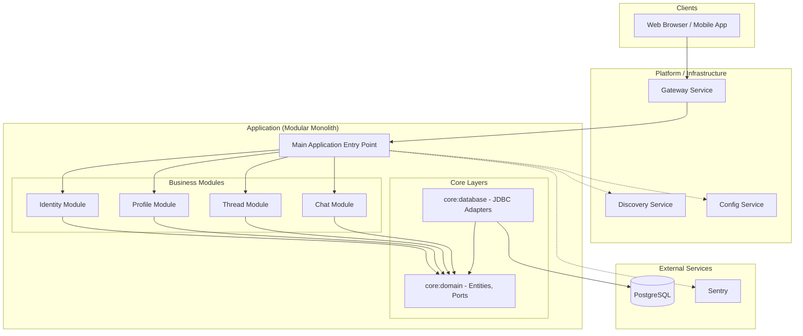

# Project Architecture

This document describes the architectural design and structural patterns of the project.

## Overview

The project is built as a **Modular Monolith** using **Spring Modulith**, following **Domain-Driven Design (DDD)** and **Clean Architecture** principles. It is designed to be highly modular, allowing for future transition to microservices if needed, supported by **Spring Cloud** infrastructure.

## Core Architectural Principles

1.  **Domain-Centric**: The business logic (Domain Layer) is at the center and has no dependencies on external frameworks or infrastructure.
2.  **Modular Boundaries**: Clear separation between functional modules (Identity, Profile, Thread, etc.) enforced by Gradle modules and Spring Modulith.
3.  **Explicit Use Cases**: Each business action is encapsulated in its own Use Case class.
4.  **Hexagonal Structure**: Separation between technical details (Adapters) and business logic (Core).

---

## High-Level Component Diagram

---

## Project Structure

The project is organized into several Gradle module groups:

### 1. `apps/`
Contains deployable applications.
- **`app`**: The main Spring Boot application that orchestrates all functional modules. It contains the **Web/API Layer** (Resources) and the **Application Layer** (Use Cases).

### 2. `core/`
Contains the shared core layers of the system.
- **`domain`**: The "Heart" of the system. Contains Entities, Value Objects, Domain Services, and Repository Interfaces (Ports). **No dependencies on frameworks.**
- **`database`**: The **Persistence Adapter**. Implements the Repository interfaces defined in the domain layer using JDBC.

### 3. `libs/`
Shared utility libraries used across the project.
- `common`: Core interfaces and base classes (e.g., `UseCaseService`, `DomainEntity`).
- `utils`: General-purpose utility classes.
- `constant`: Global constants and package definitions.
- `infrastructure`: Shared infrastructure components.

### 4. `services/`
Placeholders for functional modules that might eventually be extracted as microservices.
- `notification`, `realtime`, `worker`, `scheduler`, `media`.

### 5. `platform/`
Spring Cloud infrastructure components.
- `gateway`: API Gateway for request routing and security.
- `config`: Centralized configuration management.
- `discovery`: Service discovery (Eureka/Consul).

---

## Detailed Layered Architecture (within a Module)

Each functional module (e.g., `Identity`) follows a hexagonal structure:

| Layer | Location | Responsibility |
| :--- | :--- | :--- |
| **Web/API** | `apps/app/.../web` | REST Controllers (Resources), handling HTTP requests/responses. |
| **Application** | `apps/app/.../application` | Orchestrating business actions via **Use Cases** and **DTOs**. |
| **Domain** | `core/domain/...` | Pure business logic, Entities, and Repository Interfaces (Ports). |
| **Infrastructure** | `core/database/...` | Persistence implementation (Adapters) and external integrations. |

---

## Module Interaction Rules

Following **DDD Aggregate Encapsulation** and **Spring Modulith** rules:
- Modules should only communicate via their **Public APIs**.
- Direct access to another module's internal classes is prohibited.
- Domain Entities are encapsulated; state changes must go through the **Aggregate Root**.
- Repository interfaces are defined in the `domain` layer and implemented in the `database` layer (Dependency Inversion).

## Technology Stack

- **Language**: Java 25
- **Framework**: Spring Boot 4.0.0
- **Modularity**: Spring Modulith
- **Distributed Systems**: Spring Cloud (Gateway, Config, Discovery)
- **Persistence**: Spring JDBC / JDBC
- **Monitoring**: Sentry
- **Testing**: JUnit 5, Mockito, AssertJ, Testcontainers
- **AI Integration**: Spring AI
