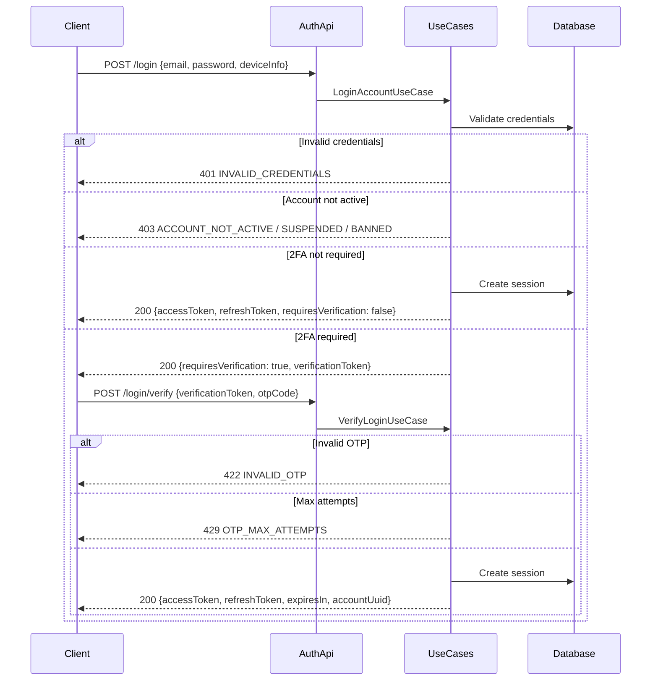

# Login Flow

## `POST /api/auth/login`

Authenticates with email and password. Returns tokens directly if 2FA is not required, otherwise returns a verification token for the second step.

**Request:**

```json
{
  "email": "user@example.com",
  "password": "securePassword123",
  "deviceInfo": {
    "deviceType": "BROWSER",
    "deviceName": "Chrome on macOS",
    "fingerprint": "abc123"
  }
}
```

**Response (200) — Direct authentication:**

```json
{
  "accessToken": "eyJ...",
  "refreshToken": "dGhpcyBpcyBhIHJlZnJlc2g...",
  "expiresIn": 3600,
  "accountUuid": "550e8400-e29b-41d4-a716-446655440000",
  "requiresVerification": false,
  "verificationToken": null
}
```

**Response (200) — 2FA required:**

```json
{
  "accessToken": null,
  "refreshToken": null,
  "expiresIn": null,
  "accountUuid": null,
  "requiresVerification": true,
  "verificationToken": "temp-token-for-2fa"
}
```

**Errors:**

| Code | Error               | When                                     |
|------|---------------------|------------------------------------------|
| 401  | INVALID_CREDENTIALS | Wrong email or password                  |
| 403  | ACCOUNT_NOT_ACTIVE  | Account hasn't been activated            |
| 403  | ACCOUNT_SUSPENDED   | Account is suspended                     |
| 403  | ACCOUNT_BANNED      | Account is banned                        |
| 403  | ACCOUNT_PENDING     | Email has not been verified              |

---

## `POST /api/auth/login/verify`

Completes two-factor login by verifying the OTP code.

**Request:**

```json
{
  "verificationToken": "temp-token-for-2fa",
  "otpCode": "123456"
}
```

**Response (200):**

```json
{
  "accessToken": "eyJ...",
  "refreshToken": "dGhpcyBpcyBhIHJlZnJlc2g...",
  "expiresIn": 3600,
  "accountUuid": "550e8400-e29b-41d4-a716-446655440000"
}
```

**Errors:**

| Code | Error                      | When                               |
|------|----------------------------|------------------------------------|
| 422  | INVALID_OTP                | OTP is invalid or expired          |
| 422  | INVALID_VERIFICATION_TOKEN | Verification token invalid/expired |
| 429  | OTP_MAX_ATTEMPTS           | Too many failed OTP attempts       |

---

## Sequence Diagram


