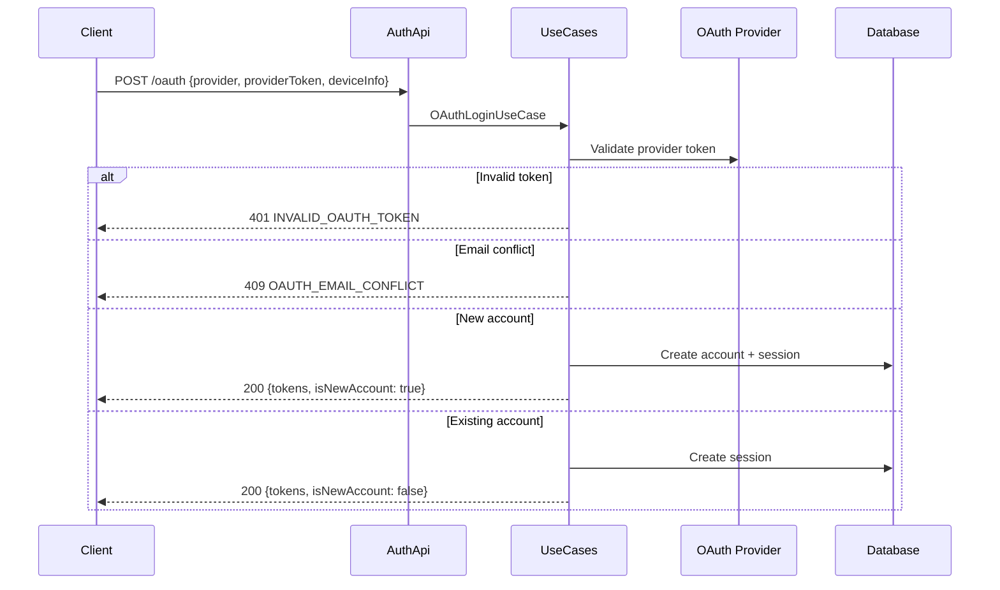

# OAuth Login Flow

## `POST /api/auth/oauth`

Authenticates using a third-party OAuth provider token (e.g. Google, GitHub). Automatically creates a new account if one does not exist for the email.

**Request:**

```json
{
  "provider": "GOOGLE",
  "providerToken": "ya29.a0AfH6SM...",
  "deviceInfo": {
    "deviceType": "MOBILE",
    "deviceName": "iPhone 15",
    "fingerprint": "xyz789"
  }
}
```

**Response (200):**

```json
{
  "accessToken": "eyJ...",
  "refreshToken": "dGhpcyBpcyBhIHJlZnJlc2g...",
  "expiresIn": 3600,
  "accountUuid": "550e8400-e29b-41d4-a716-446655440000",
  "isNewAccount": false
}
```

**Errors:**

| Code | Error                | When                                       |
|------|----------------------|--------------------------------------------|
| 401  | INVALID_OAUTH_TOKEN  | Provider token is invalid                  |
| 409  | OAUTH_EMAIL_CONFLICT | Email already linked to a different account|

---

## Sequence Diagram


