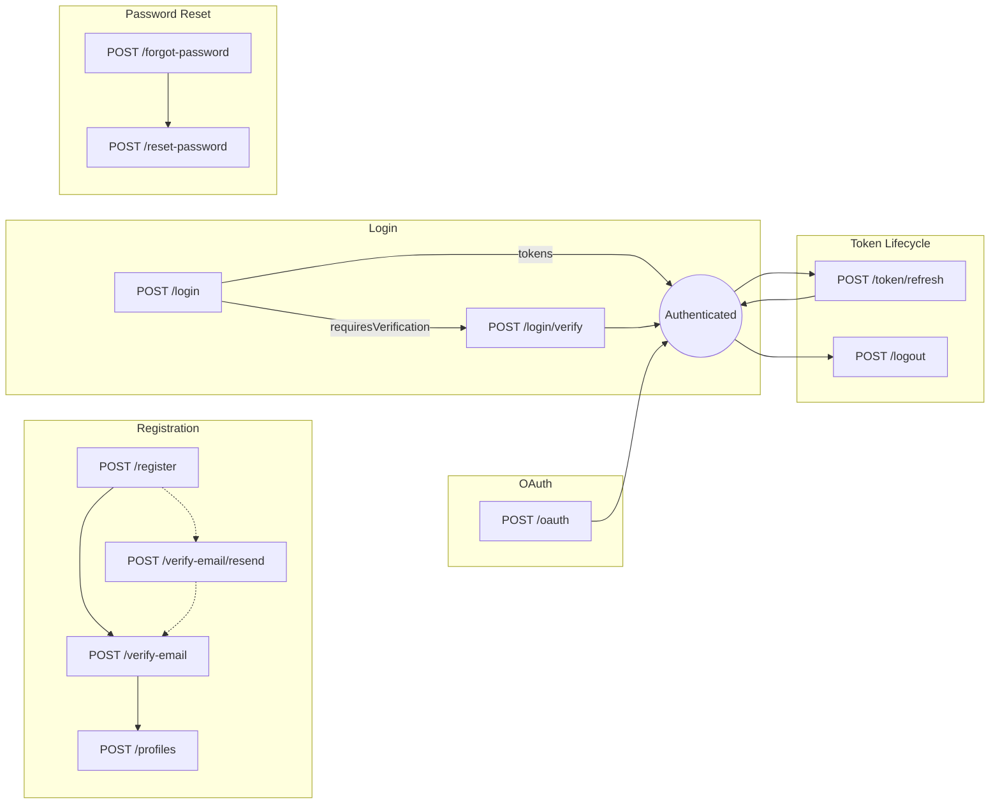

# Authentication API

## Endpoints

| Method | Path                      | Description                                   | Success | Key Errors          |
|--------|---------------------------|-----------------------------------------------|---------|---------------------|
| POST   | `/api/auth/register`      | Register a new account                        | 201     | 409, 422            |
| POST   | `/api/auth/verify-email`  | Verify email with OTP                         | 200     | 404, 409, 422       |
| POST   | `/api/auth/verify-email/resend` | Resend verification email             | 200     | 404, 409            |
| POST   | `/api/auth/login`         | Login with email & password                   | 200     | 401, 403            |
| POST   | `/api/auth/login/verify`  | Complete 2FA login with OTP                   | 200     | 422, 429            |
| POST   | `/api/auth/oauth`         | Login via OAuth provider                      | 200     | 401, 409            |
| POST   | `/api/auth/token/refresh` | Refresh access token                          | 200     | 401                 |
| POST   | `/api/auth/logout`        | Logout / revoke session                       | 204     | 401                 |
| POST   | `/api/auth/forgot-password` | Request password reset OTP                  | 200     | 404                 |
| POST   | `/api/auth/reset-password`  | Reset password with OTP                     | 200     | 404, 422            |
| POST   | `/api/profiles`           | Create a profile for the authenticated account| 201     | 400, 401, 403, 404, 409 |

## High-Level Flow

