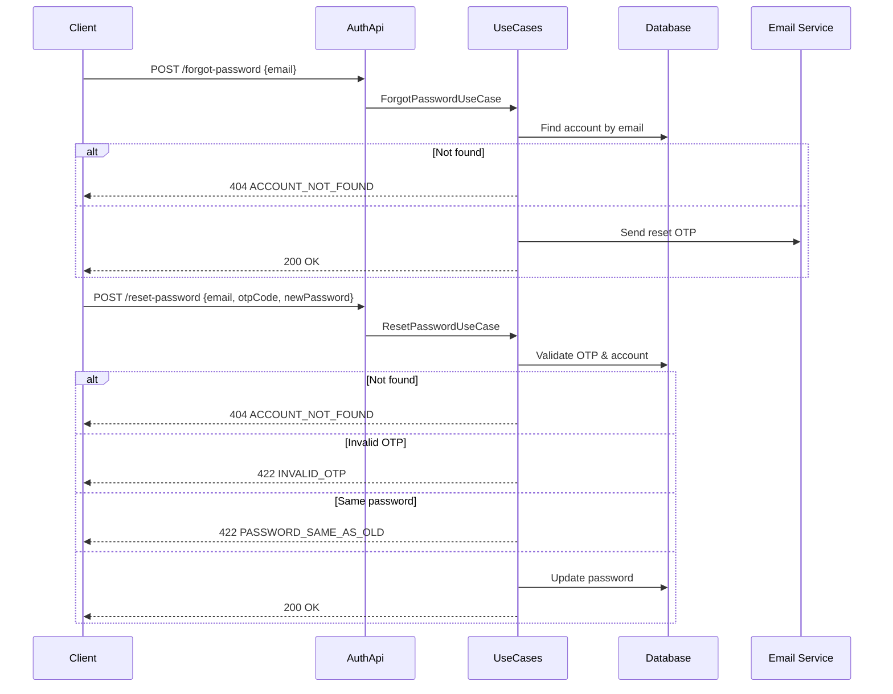

# Password Reset Flow

## `POST /api/auth/forgot-password`

Sends a password reset OTP to the specified email address.

**Request:**

```json
{
  "email": "user@example.com"
}
```

**Response:** `200 OK` (empty body)

**Errors:**

| Code | Error             | When                       |
|------|-------------------|----------------------------|
| 404  | ACCOUNT_NOT_FOUND | No account with this email |

---

## `POST /api/auth/reset-password`

Resets the account password using the OTP received via email.

**Request:**

```json
{
  "email": "user@example.com",
  "otpCode": "123456",
  "newPassword": "newSecurePassword456"
}
```

**Response:** `200 OK` (empty body)

**Errors:**

| Code | Error              | When                                       |
|------|--------------------|------------------------------------------- |
| 404  | ACCOUNT_NOT_FOUND  | No account with this email                 |
| 422  | INVALID_OTP        | OTP is invalid or expired                  |
| 422  | PASSWORD_SAME_AS_OLD | New password same as current password    |

---

## Sequence Diagram


