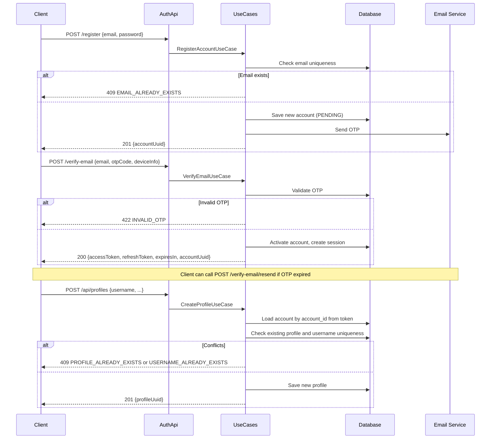

# Registration Flow

## `POST /api/auth/register`

Creates a new account and sends an OTP to the provided email.

**Request:**

```json
{
  "email": "user@example.com",
  "password": "securePassword123"
}
```

**Response (201):**

```json
{
  "accountUuid": "550e8400-e29b-41d4-a716-446655440000"
}
```

**Errors:**

| Code | Error                  | When                        |
|------|------------------------|-----------------------------|
| 409  | EMAIL_ALREADY_EXISTS   | Email is already registered |
| 422  | Validation error       | Invalid input               |

---

## `POST /api/auth/verify-email`

Verifies the account email using the OTP sent during registration. Returns auth tokens on success.

**Request:**

```json
{
  "email": "user@example.com",
  "otpCode": "123456",
  "deviceInfo": {
    "deviceType": "BROWSER",
    "deviceName": "Chrome on macOS",
    "fingerprint": "abc123"
  }
}
```

**Response (200):**

```json
{
  "accessToken": "eyJ...",
  "refreshToken": "dGhpcyBpcyBhIHJlZnJlc2g...",
  "expiresIn": 3600,
  "accountUuid": "550e8400-e29b-41d4-a716-446655440000"
}
```

**Errors:**

| Code | Error                  | When                              |
|------|------------------------|-----------------------------------|
| 404  | ACCOUNT_NOT_FOUND      | No account with this email        |
| 409  | EMAIL_ALREADY_VERIFIED | Email was already verified        |
| 422  | INVALID_OTP            | OTP is invalid or expired         |

---

## `POST /api/auth/verify-email/resend`

Resends the verification OTP if the previous one expired.

**Request:**

```json
{
  "email": "user@example.com"
}
```

**Response:** `200 OK` (empty body)

**Errors:**

| Code | Error                  | When                       |
|------|------------------------|----------------------------|
| 404  | ACCOUNT_NOT_FOUND      | No account with this email |
| 409  | EMAIL_ALREADY_VERIFIED | Already verified           |

---

## `POST /api/profiles`

Creates a profile for the authenticated account after email verification.

**Request:**

```json
{
  "username": "user1",
  "displayName": "User One"
}
```

**Response (201):**

```json
{
  "profileUuid": "550e8400-e29b-41d4-a716-446655440123"
}
```

**Errors:**

| Code | Error                   | When                                             |
|------|-------------------------|--------------------------------------------------|
| 400  | Validation error        | Invalid input                                    |
| 401  | Unauthorized            | Missing or invalid access token                  |
| 409  | PROFILE_ALREADY_EXISTS  | Profile already exists for this account          |
| 409  | USERNAME_ALREADY_EXISTS | Username is already taken                        |

---

## Sequence Diagram


