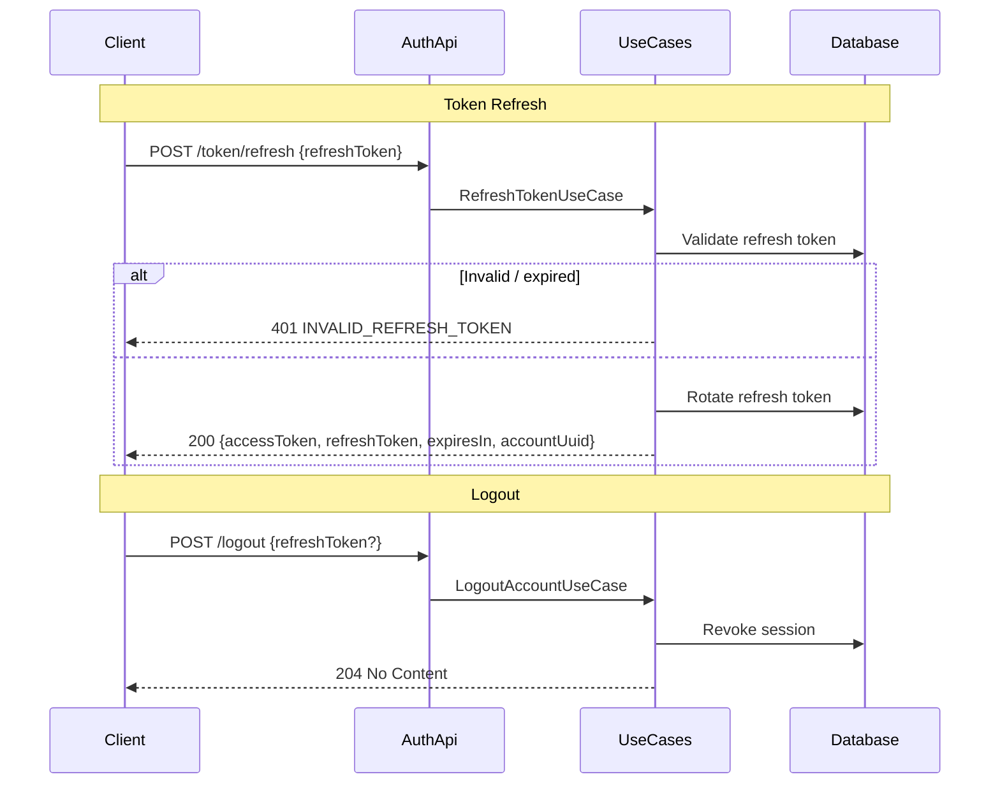

# Token Lifecycle

## `POST /api/auth/token/refresh`

Issues a new access token (and rotated refresh token) using a valid refresh token.

**Request:**

```json
{
  "refreshToken": "dGhpcyBpcyBhIHJlZnJlc2g..."
}
```

**Response (200):**

```json
{
  "accessToken": "eyJ...",
  "refreshToken": "bmV3IHJlZnJlc2ggdG9rZW4...",
  "expiresIn": 3600,
  "accountUuid": "550e8400-e29b-41d4-a716-446655440000"
}
```

**Errors:**

| Code | Error                 | When                             |
|------|-----------------------|----------------------------------|
| 401  | INVALID_REFRESH_TOKEN | Refresh token invalid or expired |

---

## `POST /api/auth/logout`

Revokes the current session. If a refresh token is provided, only that specific session is revoked.

**Request (optional body):**

```json
{
  "refreshToken": "dGhpcyBpcyBhIHJlZnJlc2g..."
}
```

**Response:** `204 No Content`

**Errors:**

| Code | Error           | When                      |
|------|-----------------|---------------------------|
| 401  | SESSION_REVOKED | Session was already revoked |

---

## Sequence Diagram


